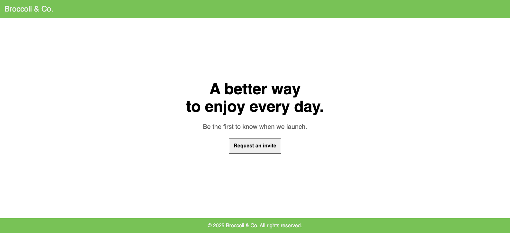
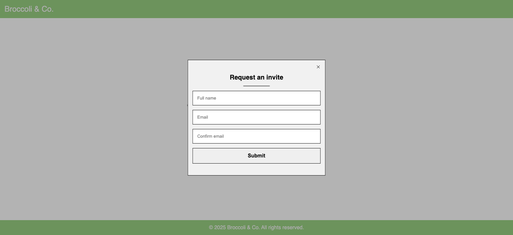

# Broccoli & Co

> **\*Broccoli & Co.**, an upcoming online service company, would like to let people to "Request an invitation" on their website.\*

**Functionality**

Create a simple yet clean homepage for them that allow users to enter their name and email to receive email invitations.

**Visual Requirements**

- The UI should occupy the full height of the screen.
- Shows a fixed header that is always on top of the window and a footer that is always on the bottom of the window (assuming a reasonable window height).
- The page content is sandwiched in the middle, containing just a heading, a small piece of text and a button to request an invite.
- A rough mockup of the basic layout is attached. While preserving this layout on desktop, you may style it however you wish, with or without images.
- The solution must be mobile friendly (users won't need to pinch and zoom on their mobile devices).

**Behaviour**

- When the Request Invite button is clicked, a popup shows containing the _Full name_, _Email_ and _Confirm Email_ nput fields.
- The user needs to fill in all three fields to request an invite. _Full name_ needs to be at least 3 characters long. _Email_ needs to be in validation email format and _Confirm Email_ needs to match Email. (You may display the validation errors inline)
- If the user clicks **Send** and one or more fields do not validate properly, the app <u>should not contact</u> the backend but instead provide appropriate feedback to the user (use your judgement on what this UX should be).
- If the user clicks **Send** and all fields validate properly, the app should send the request to the backend server (see specs below) and inform the user that the request is being sent.
  - (i) If the server returns 200 OK, it should switch to another popup, indicating that everything went through OK. This popup can be dismissed
    and will simply close - revealing the homepage again.
  - (ii) The server may return 400 Bad Request, in which case the app should simply display the error message from the server.
- The Send button can be clicked again to re-attempt the submission.

## Installation

1. Open the project in a editor and navigate to the project root directory
2. Run `npm install` to install node modules
3. Run `npm run dev` to preview application on http://localhost:5173/

## Testing

Test cases are written with React Tesing Library (RTL) and Jest to render components and simulate user interactions with the DOM. To run tests for a specific file, run `npm test <relative path>` to trigger Jest in watch mode by default. To run all tests for this project, run `npm run test:all`. Should a change be detected in the soruce of test files, Jest will automatically re-run the tests and provide real-time feedback.

## Dependencies

| Name                   | Version |
| ---------------------- | ------- |
| @testing-library       | ^16.2.0 |
| classnames             | ^2.5.1  |
| eslint                 | ^9.19.0 |
| jest                   | ^29.7.0 |
| jest.environment-jsdom | ^29.7.0 |
| node                   | ^18.0.0 |
| react                  | ^18.3.1 |
| react-icons            | ^5.4.0  |
| react-hook-forms       | ^7.54.2 |
| recoil                 | ^0.7.7  |
| typeScript             | ~5.6.2  |
| vite                   | ^6.0.5  |
